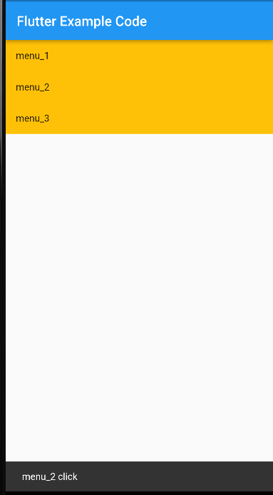

# Flutter Gesture Detector Behavior

<p align="right">작성일 : 22.10.14</p>

Gesture Detector 위젯을 사용시에, onTap 이 작동 할때도 있고, 안 할때도 있었다.   

아래 이미지 처럼, Container 에 Background Color 가 들어가 있으면 제대로 작동 했고,

없으면 제대로 작동 하지 않았다.




- GestureDetector 위젯은, 기본적으로 실제 하위 위젯의 크기만큼 터치 범위가 설정되기 때문이다.
- GestureDetector 의 behavior 속성을 변경해주면 된다.

--------------

### 사용법

```dart
GestureDetector(
    
    ...
    behavior: HitTestBehavior.~,
	...
    
),        
```

- HitTestBehavior 에는 아래의 세 가지 값이 있다.
  - deferToChild : 자식 중 한 명이 자신의 자식인 경우에만 자식에게 순응하는 대상이 자신의 범위 내에서 이벤트를 수신합니다.
  - opaque : 불투명한 대상은 hit test에 의해 hit 될 수 있으므로 둘다 해당 범위 내에서 이벤트를 수신하고 시각적으로 뒤에 있는 대상도 이벤트를 수신하지 못하도록 한다.
  - translucent : 반투명 타겟은 경계 내에서 이벤트를 수신하고 시각적으로 뒤에 있는 타겟도 이벤트를 수신하도록 허용한다.

- opaque 속성을 줘서, 빈 공간에서도 클릭 이벤트가 적용 되게 변경하였다.
