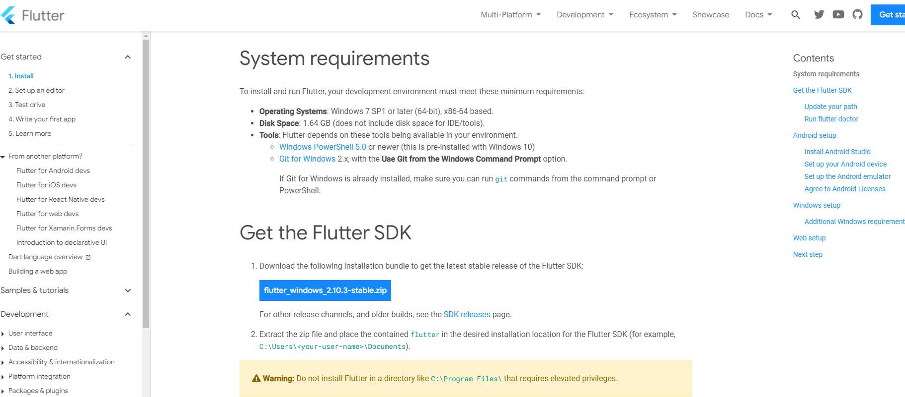
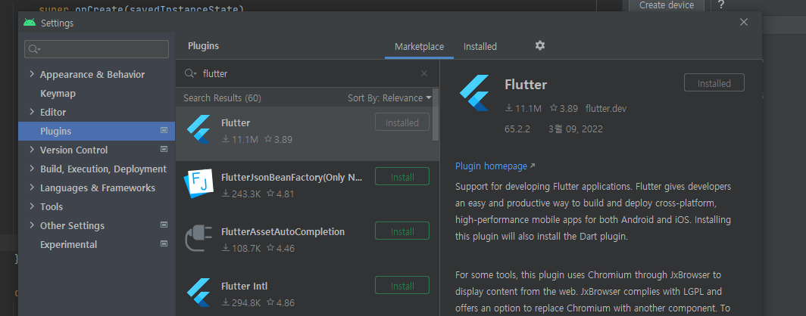
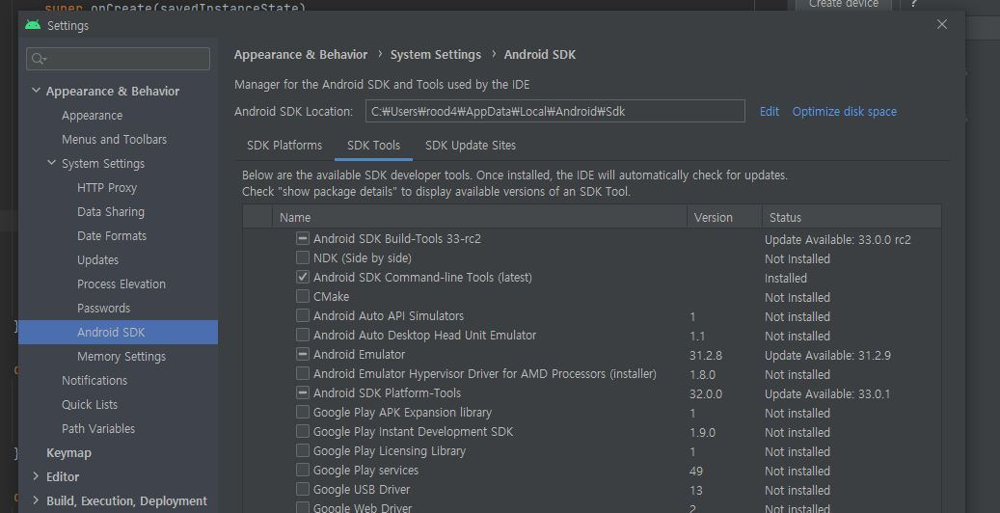
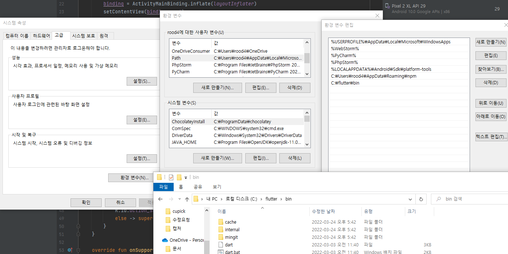
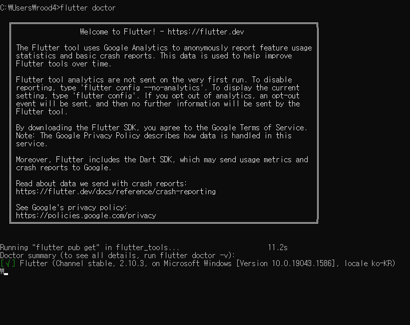

# Flutter 초기 세팅

작성일 : 22.08.14

최근 Flutter 를 개발하기 위한 환경 셋팅을 다시 해줘야 했다.

다시 그 상황이 오면 ... 귀찮지 않게 개인 참고용으로 정리 한다!

###

--------------

### 1. 안드로이드 스튜디오를 설치한다.

### 2. 최신 버전의 flutter SDK 를 다운받고, c:\ 에 압축을 푼다.

- https://docs.flutter.dev/get-started/install/windows

### 3. 안드로이드 스튜디오에서 plugin - flutter/dart 를 설치한다.

### 4. SDK 매니저에서 - SDK Tools  tab - Android SDK Command-line Tools 를 설치한다.

### 5-1. [윈도우] 시스템 환경 변수 편집 - Path 편집 - 압출 풀어준 Flutter 의 bin 폴더 path 를 신규로 추가

### 5-2. [맥] 환경 변수 편집

- https://www.youtube.com/watch?v=usE9IKaogDU&list=PLfLgtT94nNq1izG4R2WDN517iPX4WXH3C          
- 5분 대  참고.

### 6. 터미널 열어서 flutter doctor 입력

### 7. 안드로이드 스튜디오에서 신규 flutter 프로젝트 파서 작업 시작하면 됨.
